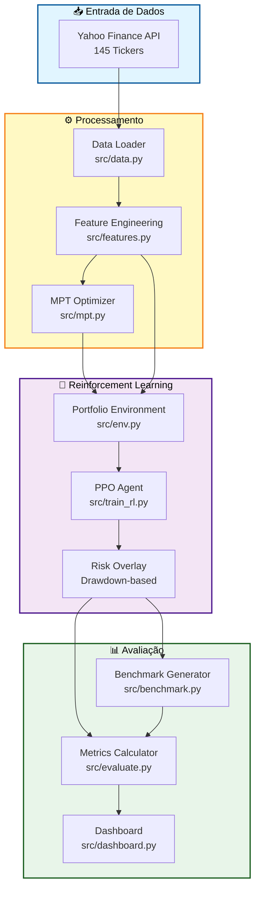
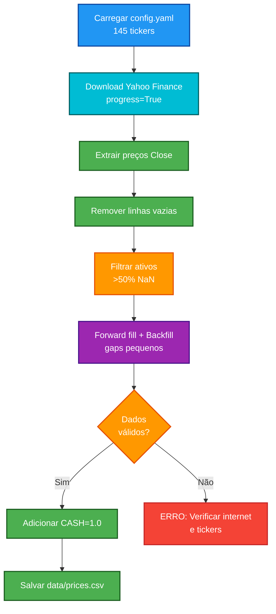
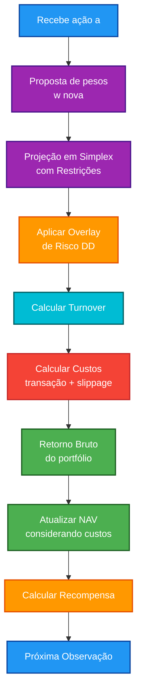
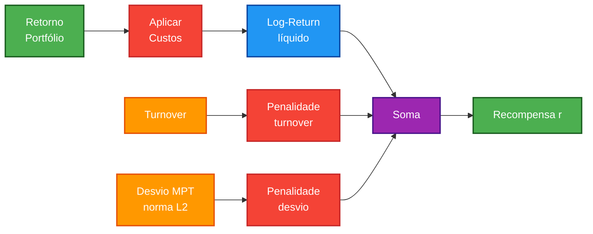
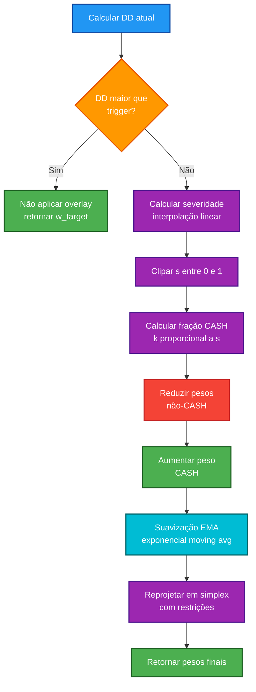
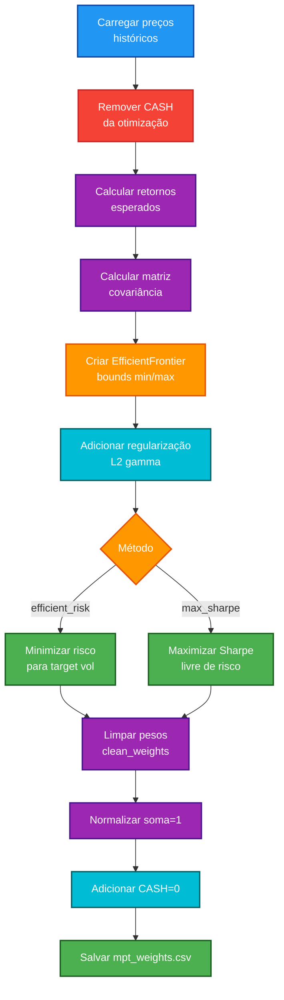
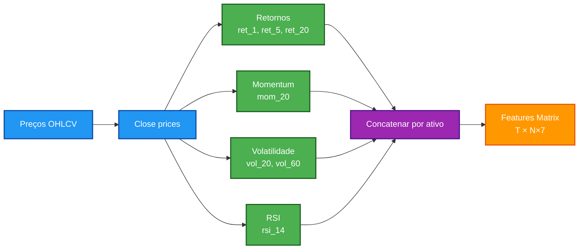
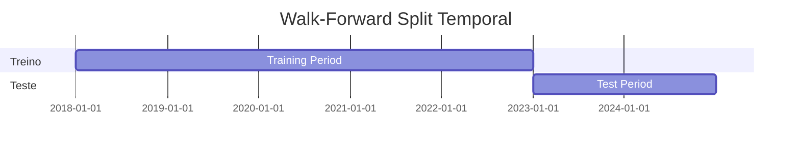

# Synapse Portfolio (Advanced): Gestor Autônomo com MPT + DRL (PPO)

> Sistema de gestão autônoma de portfólio que combina **Modern Portfolio Theory (Markowitz)** com **Deep Reinforcement Learning (PPO)** para otimização dinâmica de alocação de ativos. Utiliza 145 tickers diversificados (cryptos, ações, bonds, commodities) com proteção automática por drawdown e backtest walk-forward rigoroso. Desenvolvido para pesquisa e educação em Quant Finance e Machine Learning.

## 📋 Índice
- [Visão Geral](#-visão-geral)
- [Arquitetura do Sistema](#-arquitetura-do-sistema)
- [Pipeline de Execução](#-pipeline-de-execução)
- [Quickstart](#-quickstart)
- [Componentes Técnicos](#-componentes-técnicos)
- [Especificações do Ambiente RL](#-especificações-do-ambiente-rl)
- [Função de Recompensa](#-função-de-recompensa)
- [Overlay de Risco](#-overlay-de-risco-por-drawdown)
- [Otimização MPT](#-otimização-mpt-markowitz)  
- [Features e Sinais](#-features-e-sinais)
- [Avaliação e Métricas](#-avaliação-e-métricas)
- [Estrutura do Projeto](#-estrutura-do-projeto)
- [Configurações](#-configurações)

---

## ✨ Visão Geral

**Synapse Portfolio** é um sistema de gestão autônoma de carteiras que combina teoria clássica de portfólio (Markowitz MPT) com Deep Reinforcement Learning (DRL) usando algoritmo PPO (Proximal Policy Optimization).

### Destaques Principais

- **🎯 MPT (Markowitz)**: Calcula pesos iniciais otimizados na fronteira eficiente com restrições por ativo
- **🤖 Agente DRL (PPO)**: Aplica ajustes dinâmicos (*tilts*) sobre a alocação MPT, considerando custos de transação
- **🛡️ Overlay de Risco**: Sistema automático de proteção que aumenta alocação em CASH durante drawdowns severos
- **📊 Backtest Walk-Forward**: Validação rigorosa com separação treino/teste temporal
- **📈 Benchmarks Múltiplos**: Equal Weight (EW), MPT-only, e SPY (quando disponível)
- **📉 Métricas Completas**: Sharpe, Sortino, Calmar, MDD, Alfa, Beta, entre outras
- **🎨 Dashboard Interativo**: Interface Streamlit com visualizações e análises
- **🌐 145 Ativos**: Universo massivamente diversificado com cryptos, ações, bonds, commodities e fatores

### 🌟 Universo de 145 Ativos

Este projeto utiliza um universo **massivamente diversificado** de 145 tickers do Yahoo Finance, organizados em 18 categorias:

| Categoria | Quantidade | Exemplos |
|-----------|------------|----------|
| 🪙 Cryptos | 11 | BTC-USD, ETH-USD, SOL-USD, ADA-USD |
| 📈 Índices US | 10 | SPY, QQQ, DIA, IWM, VTI, VOO |
| 🏢 Setoriais | 11 | XLF, XLE, XLK, XLV, XLP, XLY |
| 💻 Tech & Innovation | 8 | ARKK, ARKW, HACK, BOTZ, FINX |
| 🌟 Temáticos | 7 | ICLN, TAN, LIT, DRIV, ESPO |
| 🌍 Internacional | 18 | EFA, EEM, EWZ, MCHI, INDA, EWJ |
| 🏛️ Bonds | 15 | AGG, LQD, HYG, TLT, SHY, IEF |
| 🏠 Real Estate | 5 | VNQ, XLRE, IYR, REM, VNQI |
| 💎 Commodities | 14 | GLD, SLV, USO, UNG, CORN, WEAT |
| 📊 Factors | 12 | VTV, IWD, VUG, MTUM, QUAL, USMV |
| 🌟 Ações Individuais | 27 | AAPL, MSFT, GOOGL, NVDA, TSLA |

**Vantagens**:
- ✅ Diversificação máxima entre classes de ativos
- ✅ Exposição global (US, Europa, Ásia, Emergentes)
- ✅ Cobertura de múltiplos fatores de risco
- ✅ Inclui assets alternativos (crypto, commodities)

**Desafios**:
- ⚠️ Espaço de ação grande (145 dimensões)
- ⚠️ Treino demorado (~30-60 minutos)
- ⚠️ Alguns ativos podem ter histórico insuficiente
- ⚠️ Risco de overfitting com muitos ativos

---

## 🏗️ Arquitetura do Sistema



---

## 🔄 Pipeline de Execução

```mermaid
flowchart LR
    A([Início]) --> B[data.py<br/>Download Yahoo]
    B --> C[features.py<br/>Engenharia]
    C --> D[mpt.py<br/>Pesos Iniciais]
    D --> E[train_rl.py<br/>Treino PPO]
    E --> F[benchmark.py<br/>Comparações]
    F --> G[evaluate.py<br/>Métricas]
    G --> H[dashboard.py<br/>Visualização]
    H --> I([Fim])
    
    style A fill:#4caf50,stroke:#1b5e20,stroke-width:2px,color:#fff
    style B fill:#2196f3,stroke:#0d47a1,stroke-width:2px,color:#fff
    style C fill:#2196f3,stroke:#0d47a1,stroke-width:2px,color:#fff
    style D fill:#ff9800,stroke:#e65100,stroke-width:2px,color:#fff
    style E fill:#9c27b0,stroke:#4a148c,stroke-width:2px,color:#fff
    style F fill:#00bcd4,stroke:#006064,stroke-width:2px,color:#fff
    style G fill:#00bcd4,stroke:#006064,stroke-width:2px,color:#fff
    style H fill:#4caf50,stroke:#1b5e20,stroke-width:2px,color:#fff
    style I fill:#4caf50,stroke:#1b5e20,stroke-width:2px,color:#fff
```



---

## 🚀 Quickstart

### Requisitos do Sistema

- **Python**: 3.9+
- **RAM**: Mínimo 8GB, recomendado 16GB (145 ativos)
- **Processador**: Multi-core recomendado
- **Internet**: Necessária para download dos dados do Yahoo Finance
- **Tempo de treino**: ~30-60 minutos (100k timesteps)

### Instalação

```bash
# Criar ambiente virtual
python -m venv .venv && source .venv/bin/activate   # Windows: .venv\Scripts\activate

# Instalar dependências
pip install -r requirements.txt
```

### Execução do Pipeline Completo

```bash
# 1. Carregar dados de preços (145 tickers do Yahoo Finance)
python -m src.data
# ⏱️ Espere ~2-5 minutos (download de 145 ativos)

# 2. Gerar features técnicas (145 × 7 = 1,015 features)
python -m src.features

# 3. Calcular pesos MPT iniciais (pode demorar com 145 ativos)
python -m src.mpt

# 4. Treinar agente PPO (100k timesteps)
python -m src.train_rl
# ⏱️ Espere ~30-60 minutos (depende do hardware)

# 5. Gerar benchmarks
python -m src.benchmark

# 6. Calcular métricas e gráficos
python -m src.evaluate

# 7. Abrir dashboard interativo
streamlit run src/dashboard.py
```

> **⚠️ Avisos Importantes:**
> - Alguns tickers podem falhar no download (histórico insuficiente) - é normal
> - O sistema filtra automaticamente ativos com >50% de dados faltantes
> - Cryptos têm histórico mais curto (muitas só pós-2017)
> - Treino com 145 ativos é computacionalmente intensivo

---

## 🔧 Componentes Técnicos

### 1. Data Loader (`src/data.py`)

**Responsabilidades**:
- Download de dados históricos de **145 tickers** via Yahoo Finance API
- Limpeza e tratamento de dados (remoção de NaN, forward fill)
- Filtragem automática de ativos com histórico insuficiente (>50% missing)
- Criação de ativo sintético CASH (preço constante = 1.0)

**Fluxo de Execução**:



**Universo de Ativos (145 tickers)**:
- 🪙 **11 Cryptos**: BTC-USD, ETH-USD, SOL-USD, ADA-USD, etc.
- 📈 **10 Índices US**: SPY, QQQ, DIA, IWM, VTI, VOO, etc.
- 🏢 **11 Setoriais**: XLF, XLE, XLK, XLV, XLP, XLY, XLI, XLU, XLB, XLRE, XLC
- 💻 **8 Tech & Innovation**: ARKK, ARKW, HACK, BOTZ, FINX, CLOU, SOXX, SMH
- 🌟 **7 Temáticos**: ICLN, TAN, LIT, DRIV, ESPO, JETS, UFO
- 🌍 **18 Internacional**: EFA, VEA, EEM, VWO, EWZ, MCHI, INDA, EWJ, etc.
- 🏛️ **15 Bonds**: AGG, LQD, HYG, TLT, SHY, IEF, TIP, EMB, etc.
- 🏠 **5 Real Estate**: VNQ, XLRE, IYR, REM, VNQI
- 💎 **14 Commodities**: GLD, SLV, USO, UNG, CORN, WEAT, SOYB, CPER, etc.
- 📊 **12 Factors**: VTV, IWD, VUG, IWF, MTUM, QUAL, USMV, SPLV, etc.
- 🌟 **27 Ações**: FAANG+ (AAPL, MSFT, GOOGL, etc.), Financeiro, Consumer, Healthcare, Industrial

> **Nota**: Alguns tickers podem ser excluídos automaticamente se não tiverem histórico suficiente no período 2018-2024.

### 2. Feature Engineering (`src/features.py`)

Calcula indicadores técnicos por ativo:

| Feature | Descrição | Janela |
|---------|-----------|--------|
| `ret_1` | Retorno 1 dia | - |
| `ret_5` | Retorno 5 dias | 5 |
| `ret_20` | Retorno 20 dias | 20 |
| `mom_20` | Momentum 20 dias | 20 |
| `vol_20` | Volatilidade 20 dias | 20 |
| `vol_60` | Volatilidade 60 dias | 60 |
| `rsi_14` | Relative Strength Index | 14 |

**Dimensão de Saída**: `(T, N × 7)` onde `T` = timesteps, `N` = número de ativos

**RSI Implementation**:
```python
RSI = 100 - (100 / (1 + RS))
RS = EMA(gains, 14) / EMA(losses, 14)
```

### 3. MPT Optimizer (`src/mpt.py`)

Implementa otimização de Markowitz usando `PyPortfolioOpt`:

**Objetivo**:
```
minimize: w^T Σ w + γ||w||²
subject to: w^T μ = target_return  OU  √(w^T Σ w) = target_vol
            Σ wᵢ = 1
            wₘᵢₙ ≤ wᵢ ≤ wₘₐₓ
```

Onde:
- `μ` = vetor de retornos esperados (média histórica)
- `Σ` = matriz de covariância amostral
- `γ` = coeficiente de regularização L2 (`l2_reg` no config)
- `wₘᵢₙ, wₘₐₓ` = limites por ativo

**Perfis de Risco**:
- **Conservador**: target_vol = 6%
- **Moderado**: target_vol = 10%
- **Agressivo**: target_vol = 15%

---

## 🎮 Especificações do Ambiente RL

### Observation Space

**Tipo**: `Box(shape=(obs_dim,), dtype=float32)`

**Composição**:
```
obs_dim = N × n_features + N  (se include_weights=True)
        = N × n_features      (se include_weights=False)
```

Onde:
- `N` = número de ativos
- `n_features` = 7 (ret_1, ret_5, ret_20, mom_20, vol_20, vol_60, rsi_14)

**Estrutura**:
```
[asset₁_feat₁, ..., asset₁_feat₇, asset₂_feat₁, ..., assetₙ_feat₇, w₁, ..., wₙ]
```

### Action Space

**Tipo**: `Box(low=-1, high=1, shape=(N,), dtype=float32)`

**Interpretação**: Ações contínuas no intervalo [-1, 1] representando ajustes propostos.

### Dinâmica de Transição



### Projeção em Simplex com Restrições

Algoritmo de bisseção para projetar vetor `v` no simplex com limites:

```
w* = arg min ||w - v||²
     subject to: Σ wᵢ = 1
                 l ≤ wᵢ ≤ u  ∀i
```

**Implementação**: `project_capped_simplex()` com complexidade O(100·N)

---

## 💰 Função de Recompensa

A recompensa é composta por múltiplos termos que balanceiam retorno, risco e custos:

```
r = log(1 + rₜ - cₜ) - λ_turnover·τₜ - λ_dev·||wₜ - w_MPT||₂
```

**Componentes**:

| Termo | Descrição | Coeficiente |
|-------|-----------|-------------|
| `log(1 + rₜ - cₜ)` | Retorno líquido logarítmico | - |
| `λ_turnover·τₜ` | Penalidade por rotatividade | `turnover_penalty` |
| `λ_dev·||wₜ - w_MPT||₂` | Penalidade por desvio do MPT | `deviation_penalty` |

**Custos de Transação**:
```
cₜ = τₜ · (tx_bps + slp_bps) / 10000
τₜ = Σᵢ |wᵢ,ₜ - wᵢ,ₜ₋₁|
```

Onde:
- `tx_bps` = custos de transação em basis points (padrão: 5)
- `slp_bps` = slippage em basis points (padrão: 2)

**Fluxograma da Recompensa**:



---

## 🛡️ Overlay de Risco por Drawdown

Sistema automático de proteção que aumenta alocação em CASH durante drawdowns severos.

### Lógica de Ativação



### Fórmulas

**Drawdown**:
```
DD = (NAV / max_NAV) - 1
```

**Severidade** (interpolação linear):
```
s = clip((|DD| - |dd_trigger|) / (|dd_hard| - |dd_trigger|), 0, 1)
```

**Fração de CASH**:
```
k = s · max_cash
```

**Suavização Exponencial**:
```
w_smooth = α · w_target + (1 - α) · w_adjusted
```

Onde `α = smoothing` (padrão: 0.90)

### Parâmetros Padrão

| Parâmetro | Valor | Descrição |
|-----------|-------|-----------|
| `dd_trigger` | -0.10 | Ativa overlay a -10% de DD |
| `dd_hard` | -0.25 | Overlay máximo a -25% de DD |
| `max_cash` | 0.60 | Até 60% em CASH no máximo |
| `smoothing` | 0.90 | Coeficiente de suavização EMA |

---

## 📊 Otimização MPT (Markowitz)

### Processo de Otimização



### Formulação Matemática

**Retornos Esperados** (média histórica composta):
```
μᵢ = E[Rᵢ] calculado via método mean_historical_return
```

**Matriz de Covariância** (amostral):
```
Σᵢⱼ = Cov(Rᵢ, Rⱼ)
```

**Problema de Otimização**:

*Efficient Risk*:
```
minimize: w^T Σ w + γ||w||²
subject to: √(w^T Σ w) = σ_target
            Σ wᵢ = 1
            wₘᵢₙ ≤ wᵢ ≤ wₘₐₓ
```

*Max Sharpe*:
```
maximize: (w^T μ - rf) / √(w^T Σ w)
subject to: Σ wᵢ = 1
            wₘᵢₙ ≤ wᵢ ≤ wₘₐₓ
```

---

## 🔬 Features e Sinais

### Pipeline de Features



### Cálculo de Indicadores

**Retornos**:
```python
ret_t = (price_t / price_{t-k}) - 1
```

**Volatilidade Realizada**:
```python
vol_k = std(returns) * sqrt(252/k)  # anualizada
```

**RSI (Relative Strength Index)**:
```python
gains = max(delta, 0)
losses = max(-delta, 0)
RS = EMA(gains, 14) / EMA(losses, 14)
RSI = 100 - (100 / (1 + RS))
```

---

## 📈 Avaliação e Métricas

### Métricas Calculadas

| Métrica | Fórmula | Interpretação |
|---------|---------|---------------|
| **CAGR** | `(NAV_final / NAV_initial)^(252/T) - 1` | Retorno anualizado composto |
| **Sharpe Ratio** | `(μ - rf) / σ` | Retorno ajustado ao risco total |
| **Sortino Ratio** | `(μ - rf) / σ_downside` | Retorno ajustado ao risco de queda |
| **Calmar Ratio** | `CAGR / |MaxDD|` | Retorno por unidade de DD máximo |
| **Max Drawdown** | `min(NAV / peak_NAV - 1)` | Maior perda do pico ao vale |
| **Alpha** | `α` do CAPM vs benchmark | Excesso de retorno vs mercado |
| **Beta** | `β` do CAPM vs benchmark | Sensibilidade ao mercado |
| **Turnover** | `E[Σ\|w_t - w_{t-1}\|]` | Rotatividade média da carteira |

### Benchmarks Gerados

1. **Equal Weight (EW)**: Pesos iguais em todos os ativos (exceto CASH)
   ```
   w_i = 1/N  ∀i ≠ CASH
   ```

2. **MPT-only**: Pesos MPT fixos sem ajustes do agente RL

3. **SPY**: Buy & hold do S&P 500 (quando disponível na base)

### Gráficos Produzidos

- **Equity Curve**: Evolução do NAV ao longo do tempo
- **Drawdown Chart**: Histórico de drawdowns
- **Rolling Sharpe**: Sharpe ratio em janela móvel (se implementado no dashboard)

---

## 📁 Estrutura do Projeto

```
synapse_portfolio_advanced/
├── src/
│   ├── __init__.py
│   ├── config.yaml          # Configurações centralizadas (145 tickers)
│   ├── utils.py             # Funções auxiliares
│   ├── data.py              # Download Yahoo Finance (145 ativos)
│   ├── features.py          # Engenharia de features (7 por ativo)
│   ├── mpt.py               # Otimização Markowitz
│   ├── env.py               # Ambiente Gymnasium (PortfolioEnv)
│   ├── train_rl.py          # Treinamento PPO
│   ├── benchmark.py         # Geração de benchmarks
│   ├── backtest.py          # (Reservado para backtests adicionais)
│   ├── evaluate.py          # Cálculo de métricas e plots
│   └── dashboard.py         # Interface Streamlit
├── data/
│   └── prices.csv           # (gerado) Preços históricos do Yahoo Finance
├── models/
│   ├── ppo_synapse.zip      # (gerado) Modelo PPO treinado
│   └── best/                # (gerado) Melhor modelo via callback
├── outputs/
│   ├── features.csv         # (gerado) Features calculadas (145 × 7)
│   ├── mpt_weights.csv      # (gerado) Pesos MPT iniciais
│   ├── test_equity_curve.csv # (gerado) NAV do agente no teste
│   ├── test_weights.csv     # (gerado) Pesos ao longo do teste
│   ├── benchmarks.csv       # (gerado) NAV dos benchmarks
│   ├── metrics.json         # (gerado) Métricas agregadas
│   ├── report.md            # (gerado) Relatório em Markdown
│   ├── equity_curve.png     # (gerado) Gráfico de equity
│   ├── drawdown.png         # (gerado) Gráfico de drawdown
│   └── tb/                  # (gerado) TensorBoard logs
├── tests/
│   ├── test_env.py          # Testes unitários do ambiente
│   └── test_metrics.py      # Testes das métricas
├── requirements.txt         # Dependências Python
├── Makefile                 # Comandos automatizados
├── Dockerfile               # Container Docker
└── README.md                # Esta documentação
```

---

## ⚙️ Personalização e Configuração

Todas as configurações estão centralizadas em `src/config.yaml`. O projeto é **totalmente personalizável** - você pode escolher exatamente quais ativos usar, períodos de dados, parâmetros de risco e muito mais.

### Universo de Ativos
```yaml
universe:
  tickers: [
    # 145 tickers organizados em 18 categorias:
    # Cryptos (11), Índices US (10), Setoriais (11),
    # Tech & Innovation (8), Temáticos (7), Internacional (18),
    # Bonds (15), Real Estate (5), Commodities (14),
    # Factors (12), Ações individuais (27)
    "BTC-USD", "ETH-USD", "SOL-USD", # ... (ver config.yaml completo)
    "SPY", "QQQ", "DIA", "IWM", # ...
    # ... total de 145 tickers
  ]
  start_date: "2018-01-01"
  end_date: "2024-12-31"
  frequency: "1d"
  include_cash: true
  cash_symbol: "CASH"
```

> **Ver arquivo `src/config.yaml` para lista completa dos 145 tickers.**

### Período dos Dados e Divisão Treino/Teste

**Dados Completos:**
- **Período**: Janeiro de 2018 até Dezembro de 2024
- **Duração**: 7 anos de dados históricos
- **Fonte**: Yahoo Finance (145 tickers)

**Walk-Forward Split:**

| Tipo | Período | Duração | Uso |
|------|---------|---------|-----|
| 🟦 **Treino** | 2018-01-01 até 2022-12-31 | 5 anos | Treinar agente PPO |
| 🟩 **Teste** | 2023-01-01 até 2024-12-31 | 2 anos | Avaliar performance out-of-sample |

**Por que essas datas?**

O período 2018-2024 captura diferentes regimes de mercado:
- **2018-2019**: Mercado relativamente estável
- **2020**: COVID-19 (crash + recuperação rápida)
- **2021-2022**: Alta inflação, subida agressiva de juros
- **2023-2024**: Período recente para validação real (dados futuros)

**Split 5 anos treino / 2 anos teste** garante:
- ✅ Dados suficientes para o agente aprender padrões robustos
- ✅ Teste em dados completamente futuros (sem data leakage)
- ✅ Validação realista da capacidade de generalização

**⚠️ Nota sobre histórico de ativos:**
- Cryptos: Muitas criptomoedas só existem pós-2017/2018
- ETFs temáticos: Alguns ETFs são recentes (pós-2019)
- Sistema filtra automaticamente ativos com >50% de dados faltantes

---

### 🎨 Como Personalizar Tickers e Datas

O projeto é **totalmente customizável**. Edite `src/config.yaml` para criar seu próprio universo:

#### **Exemplo 1: Portfolio Conservador Brasileiro**

```yaml
universe:
  tickers: [
    # Bolsa brasileira
    "BOVA11.SA",   # Ibovespa
    "IVVB11.SA",   # S&P 500 BDR
    "IMAB11.SA",   # IMA-B (títulos públicos)
    "GOLD11.SA",   # Ouro
    # Globais
    "SPY", "AGG", "GLD"
  ]
  start_date: "2020-01-01"
  end_date: "2024-12-31"
```

#### **Exemplo 2: Portfolio Tech Agressivo**

```yaml
universe:
  tickers: [
    # FAANG+
    "AAPL", "MSFT", "GOOGL", "AMZN", "META", "NVDA", "TSLA",
    # Crypto
    "BTC-USD", "ETH-USD", "SOL-USD",
    # Tech ETFs
    "QQQ", "ARKK", "ARKW", "SOXX",
    # Hedge
    "GLD", "TLT"
  ]
  start_date: "2019-01-01"
  end_date: "2024-12-31"
```

#### **Exemplo 3: Portfolio Setorial Diversificado**

```yaml
universe:
  tickers: [
    # Setores GICS
    "XLF", "XLE", "XLK", "XLV", "XLP", "XLY",
    # Internacional
    "EFA", "EEM", "VWO",
    # Bonds
    "AGG", "LQD", "HYG",
    # Commodities
    "GLD", "USO", "DBA"
  ]
  start_date: "2018-01-01"
  end_date: "2024-12-31"
```

#### **Exemplo 4: Portfolio Rápido para Testes**

```yaml
universe:
  tickers: [
    # Apenas 5 ativos para treino rápido
    "SPY", "AGG", "GLD", "BTC-USD", "CASH"
  ]
  start_date: "2022-01-01"  # Menos dados
  end_date: "2024-12-31"

walk_forward:
  train_start: "2022-01-01"
  train_end: "2023-12-31"
  test_start: "2024-01-01"
  test_end: "2024-12-31"

ppo:
  total_timesteps: 10000  # Treino rápido (~5-10 min)
```

#### **🌍 Como Encontrar Tickers no Yahoo Finance**

- **Ações US**: Símbolo direto (ex: `AAPL`, `TSLA`)
- **Ações Brasil**: Adicione `.SA` (ex: `PETR4.SA`, `VALE3.SA`)
- **ETFs**: Símbolo do ETF (ex: `SPY`, `QQQ`, `BOVA11.SA`)
- **Cryptos**: Adicione `-USD` (ex: `BTC-USD`, `ETH-USD`)
- **Forex**: Use formato `EURUSD=X`
- **Commodities**: Use futuros (ex: `GC=F` para ouro, `CL=F` para petróleo)

**Buscar tickers**: https://finance.yahoo.com/lookup

#### **📅 Customizar Períodos**

```yaml
# Teste em bull market (2020-2021)
universe:
  start_date: "2019-01-01"
  end_date: "2021-12-31"

walk_forward:
  train_start: "2019-01-01"
  train_end: "2020-12-31"
  test_start: "2021-01-01"
  test_end: "2021-12-31"

# Teste em bear market (2022)
universe:
  start_date: "2021-01-01"
  end_date: "2023-12-31"

walk_forward:
  train_start: "2021-01-01"
  train_end: "2022-06-30"
  test_start: "2022-07-01"
  test_end: "2023-12-31"

# Teste em período recente (2023-2024)
universe:
  start_date: "2022-01-01"
  end_date: "2024-12-31"

walk_forward:
  train_start: "2022-01-01"
  train_end: "2023-12-31"
  test_start: "2024-01-01"
  test_end: "2024-12-31"
```

#### **⚙️ Ajustar Outros Parâmetros**

```yaml
# Concentração máxima por ativo
risk:
  max_weight: 0.25  # Até 25% em cada ativo

# Custos mais realistas para investidor varejo
risk:
  transaction_cost_bps: 10  # 0.1%
  slippage_bps: 5           # 0.05%

# Overlay de risco mais conservador
risk_overlay:
  dd_trigger: -0.05  # Ativa com -5% de drawdown
  max_cash: 0.80     # Até 80% em CASH

# Treino mais longo para melhor performance
ppo:
  total_timesteps: 200000  # 200k steps (~1-2 horas)
```

#### **💡 Dicas de Personalização**

1. **Começar pequeno**: Teste com 5-10 ativos antes de usar 145
2. **Dados recentes**: Períodos curtos (2-3 anos) treinam mais rápido
3. **Walk-forward apropriado**: Mínimo 1 ano de treino, 6 meses de teste
4. **Correlações**: Evite ativos muito correlacionados (ex: SPY + VOO + VTI)
5. **Liquidez**: Use ativos líquidos para custos realistas
6. **Histórico**: Verifique se todos os tickers têm dados no período escolhido

---

### Gestão de Risco
```yaml
risk:
  risk_free_rate: 0.015      # Taxa livre de risco (1.5%)
  min_weight: 0.0            # Peso mínimo por ativo
  max_weight: 0.15           # Peso máximo por ativo (15% para 145 ativos)
  transaction_cost_bps: 5    # Custos de transação (5 bps)
  slippage_bps: 2            # Slippage (2 bps)
  deviation_penalty: 0.02    # Penalidade desvio MPT (λ_dev)
  turnover_penalty: 0.10     # Penalidade turnover (λ_turnover)
```

> **Nota**: `max_weight` de 15% garante diversificação adequada com 145 ativos no universo.

### MPT
```yaml
mpt:
  profile: "moderado"        # conservador|moderado|agressivo
  target_vol:
    conservador: 0.06
    moderado: 0.10
    agressivo: 0.15
  l2_reg: 0.001              # Regularização L2 (γ)
```

### Walk-Forward Split
```yaml
walk_forward:
  train_start: "2018-01-01"
  train_end:   "2022-12-31"
  test_start:  "2023-01-01"
  test_end:    "2024-12-31"
```

### Ambiente RL
```yaml
env:
  window_size: 60            # Janela de lookback (não usada atualmente)
  include_weights: true      # Incluir pesos na observação
  step_scale: 0.25           # Escala das ações (α)
  action_temperature: 1.0    # Temperatura (não usado)
```

### Overlay de Risco
```yaml
risk_overlay:
  dd_trigger: -0.10          # Ativa a -10% DD
  dd_hard:    -0.25          # Máximo a -25% DD
  max_cash:   0.60           # Até 60% em CASH
  smoothing:  0.90           # EMA α = 0.90
```

### PPO Hyperparameters
```yaml
ppo:
  total_timesteps: 100000    # Total de steps de treino
  learning_rate: 0.0003      # Taxa de aprendizado
  n_steps: 2048              # Steps por rollout
  batch_size: 256            # Tamanho do batch
  gamma: 0.99                # Fator de desconto
  gae_lambda: 0.95           # GAE λ
  clip_range: 0.2            # PPO clip ε
  ent_coef: 0.0              # Coeficiente de entropia
  vf_coef: 0.5               # Coeficiente da value function
```

> **Nota**: Com 100k timesteps e 145 dimensões de ação, espere treino de ~30-60 minutos dependendo do hardware.

---

## 🔬 Detalhes de Implementação

### Algoritmo PPO (Proximal Policy Optimization)

**Objetivo de Clipping**:
```
L^CLIP(θ) = E[min(r_t(θ)·A_t, clip(r_t(θ), 1-ε, 1+ε)·A_t)]
```

Onde:
- `r_t(θ) = π_θ(a_t|s_t) / π_θ_old(a_t|s_t)` (probability ratio)
- `A_t` = vantagem estimada via GAE (Generalized Advantage Estimation)
- `ε` = clip_range (padrão: 0.2)

**GAE (Generalized Advantage Estimation)**:
```
A_t^GAE = Σ_{l=0}^∞ (γλ)^l δ_{t+l}
δ_t = r_t + γV(s_{t+1}) - V(s_t)
```

### Walk-Forward Validation



O agente é treinado apenas em dados de 2018-2022 e avaliado em dados futuros de 2023-2024 que nunca viu durante o treino.

---

## 🐳 Docker

```bash
# Build da imagem
docker build -t synapse-portfolio .

# Executar pipeline completo
docker run --rm -v $(pwd)/outputs:/app/outputs synapse-portfolio

# Executar dashboard (necessário expor porta)
docker run --rm -p 8501:8501 synapse-portfolio streamlit run src/dashboard.py
```

---

## 🧪 Testes

```bash
# Executar testes unitários
python -m pytest tests/ -v

# Testar apenas o ambiente
python -m pytest tests/test_env.py -v

# Testar métricas
python -m pytest tests/test_metrics.py -v
```

---

## 📚 Referências

### Papers
- Markowitz, H. (1952). "Portfolio Selection". *Journal of Finance*
- Schulman et al. (2017). "Proximal Policy Optimization Algorithms". *arXiv:1707.06347*
- Jiang et al. (2017). "A Deep Reinforcement Learning Framework for the Financial Portfolio Management Problem". *arXiv:1706.10059*

### Bibliotecas
- [Stable-Baselines3](https://stable-baselines3.readthedocs.io/) - Implementações RL
- [PyPortfolioOpt](https://pyportfolioopt.readthedocs.io/) - Otimização de portfólio
- [Gymnasium](https://gymnasium.farama.org/) - Interface de ambientes RL

---

## 🤝 Contribuindo

Para contribuir com o projeto:

1. Fork o repositório
2. Crie uma branch para sua feature (`git checkout -b feature/MinhaFeature`)
3. Commit suas mudanças (`git commit -m 'Adiciona MinhaFeature'`)
4. Push para a branch (`git push origin feature/MinhaFeature`)
5. Abra um Pull Request

---

Desenvolvido para a comunidade de Quant Finance e Machine Learning
